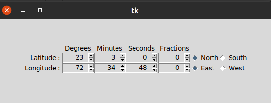

# vau widgets
**tKinter / ttk Widgets**

* DateEntry Widget

A compound widget inherited from Frame. Facilitates easy handling of Entry of Python Date.
  
* TimeEntry Widget 

A compound widget inherited from Frame. Facilitates easy handling of Entry of Python Time.

* DMSEntry Widget 
A compound widget inherited from Frame. Facilitates easy handling of Entry of Angular Measurement in Arc Degrees, Arc Minutes, Arc Seconds and Fractions of Arc Seconds.

* LatLonEntry Widget

A compound widget inherited from Frame. Facilitates easy handling of Entry of Latitudes and Longitudes.

